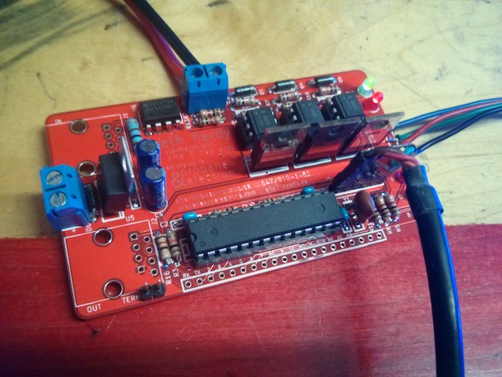

bcard-rgbdmx
------------

I recently ran out of my PCB business cards. Rather than just get another run printed, I designed a new one. Inspired by using DMX512 with a [fenode](https://github.com/propane-and-electrons/fenode) board, the new cards are Arduino-compatible three channel controllers with an RS-485 interface.

As DMX is not supposed to be used with potentially dangerous devices, these boards are meant to turn 12V RGB LED strips into cheap DMX fixtures. Why a separate load power input (suitable for a deadman switch) remains on the board is left as an exercise for the reader.

### Feature Summary

* Arduino compatible
* Programmable via 6-pin FTDI header
* Three DC load channels switched via MOSFET
* DC load power is optoisolated from the control system power
* Each output channel has a status LED for easy debugging
* Header pins for DC load power and three output channels, suitable for common anode LED strips
* All Arduino pins are broken out
* RS-485 serial interface, suitable for DMX512
* 8P8C connectors for serial in/out
* Termination resistor with jumper

### Documents

* [Schematic](docs/bcard-rgbdmx-schematic.pdf)
* [Bill of Materials](docs/bcard-rgbdmx-BOM.csv)